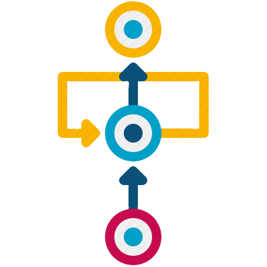

<!-- Improved compatibility of back to top link: See: https://github.com/othneildrew/Best-README-Template/pull/73 -->
<a name="readme-top"></a>
<!--
*** Thanks for checking out the Best-README-Template. If you have a suggestion
*** that would make this better, please fork the repo and create a pull request
*** or simply open an issue with the tag "enhancement".
*** Don't forget to give the project a star!
*** Thanks again! Now go create something AMAZING! :D
-->


<!-- PROJECT SHIELDS -->
<!--
*** I'm using markdown "reference style" links for readability.
*** Reference links are enclosed in brackets [ ] instead of parentheses ( ).
*** See the bottom of this document for the declaration of the reference variables
*** for contributors-url, forks-url, etc. This is an optional, concise syntax you may use.
*** https://www.markdownguide.org/basic-syntax/#reference-style-links
-->
[![Contributors][contributors-shield]][contributors-url]
[![Forks][forks-shield]][forks-url]
[![Stargazers][stars-shield]][stars-url]
[![Issues][issues-shield]][issues-url]
[![MIT License][license-shield]][license-url]
[![LinkedIn][linkedin-shield]][linkedin-url]


<!-- PROJECT LOGO -->
<br />
<div align="center">
  <a href="https://github.com/hmpatel1350/ISP-Resarch">
    
  </a>

<h3 align="center">Dynamical System Approaches for Training Neural Networks</h3>

  <p align="center">
    Research on better ways to train RNNs and other Neural Networks by viewing them from a Dynamical System perspective.
    <br />
    <a href="https://github.com/hmpatel1350/ISP-Resarch"><strong>Explore the docs »</strong></a>
    <br />
    <br />
    <!--<a href="https://github.com/hmpatel1350/ISP-Resarch">View Demo</a>
    ·
    <a href="https://github.com/hmpatel1350/ISP-Resarche/issues">Report Bug</a>
    ·
    <a href="https://github.com/hmpatel1350/ISP-Resarch/issues">Request Feature</a>!-->
  </p>
</div>


<!-- TABLE OF CONTENTS -->
<details>
  <summary>Table of Contents</summary>
  <ol>
    <li>
      <a href="#about-the-project">About The Project</a>
      <ul>
        <li><a href="#built-with">Built With</a></li>
      </ul>
    </li>
    <li>
      <a href="#getting-started">Getting Started</a>
      <ul>
        <li><a href="#prerequisites">Prerequisites</a></li>
        <li><a href="#installation">Installation</a></li>
      </ul>
    </li>
    <li><a href="#usage">Usage</a></li>
    <li><a href="#project-structure">Project Structure</a></li>
    <li><a href="#roadmap">Roadmap</a></li>
    <li><a href="#license">License</a></li>
    <li><a href="#contact">Contact</a></li>
    <li><a href="#acknowledgments">Acknowledgments</a></li>
  </ol>
</details>


<!-- ABOUT THE PROJECT -->
## About The Project
<!--[![Product Name Screen Shot][product-screenshot]](https://example.com)-->

Research project at WPI in collaboration with Professor Randy Paffenroth over the course of the 2023-2024 school year. 
This project is about finding better ways to train Recurrent Neural Networks to improve their ability to converge as well
as analyzing their behavior and results using Dynamical Systems.

<p align="right">(<a href="#readme-top">back to top</a>)</p>


### Built With

* 
* 
* 

<p align="right">(<a href="#readme-top">back to top</a>)</p>


<!-- GETTING STARTED -->
## Getting Started

This is an example of how you may give instructions on setting up your project locally.
To get a local copy up and running follow these simple example steps.

### Prerequisites
* Ideally get access to WPI Turing to run SLURM tests, although this is not required as code can still run locally.
To request and learn how to access Turing, visit the documentation here: https://arc.wpi.edu/turing-basic-user-guide/

* Create a Python virtual environment (either locally or in Turing), using the following command:
    ```sh
  python -m venv /path/to/new/virtual/environment
    ```
* Download this repository, either locally or to Turing  

  
* Create a Weights and Biases account: https://wandb.ai/

### Installation
1. Use pip to install all the required libraries
    ```sh
    pip install -r ./requirements.txt
    ```
2. Login into wandb using the following command in your terminal and getting your API key from this URL: https://wandb.ai/authorize

    ```sh
    wandb login
    ```

3. If running locally on an NVIDIA GPU be sure to download the CUDA Toolkit to utilize the GPUs for training. Check on Pytorch
which version of CUDA is currently supported. The current toolkit version can be found here: https://developer.nvidia.com/cuda-downloads
    - Skip if using Turing

<p align="right">(<a href="#readme-top">back to top</a>)</p>


<!-- USAGE EXAMPLES -->
## Usage

To run the code locally, run the `main.py` file with command line arguments, and with Turing edit `main.sh` 
for the desired arguments and run it with ```sbatch main.sh```

The arguments are in the following order:
```sh
python main.py [model-type] [wrong-hint] [wrong-eval] [max-loops] [epochs-per-loop] [problem-type] [criterion]
```

* `model-type`: Which type of model to use **(1,2,3,4)**
  * 1: Continuous (Hadamard) with initialized parameters that make the weights
  * 2: Continuous (Hadamard) with initialized weights
  * 3: Discontinuous (Piecewise) with initialized parameters that make the weights
  * 4: Discontinuous (Piecewise) with initialized weights
* `wrong-hint`: Whether to give random, wrong classification hints to the model during training **("False", "True")**
  * False: Don't use wrong classifications (always the correct hint)
  * True: Use a randomly chosen classification hint everytime
* `wrong-eval`: Whether to give random, wrong classification hints to the model during evaluation **("False", "True")**
  * False: Don't use wrong classifications (always the correct hint)
  * True: Use a randomly chosen classification hint everytime
* `max-loops`: Maximum number of loops to train the model to **(integer >= 1)**
* `epochs-per-loop`: How many training epochs to before adding in a new loop to the model **(integer >= 1)**
* `problem-type`: Which problem to test the model on **(1,2)**
  * 1: Regular denoising classifier 
  * 2: Treating image as a classification
* `criterion`: Which loss function to use **(1,2)**
  * 1: MSE Loss
  * 2: Cross Entropy Loss

<!--_For more examples, please refer to the [Documentation](https://example.com)_-->

<p align="right">(<a href="#readme-top">back to top</a>)</p>

## Project Structure

The project is seperated into three parts, the main files, the models folder, and the problems folder.

1. Main Files:
   - These are `main.py` and `main.sh`, which is used to actually run the program. `main.py` contains the logic for running the code
   using the user specified parameters, and `main.sh` is used to run it in SLURM
2. Models Folder:
   - This folder contains the various different model types. `models_interfaces.py` contains classes with the base model
   logic that can be overriden for more specific logic
   - `nn_continuous.py` contains the two Hadamard continuous models
   - `nn_discontinuous.py` contains the two Piecewise discontinuous models
3. Problems Folder:
   - This folder contains the different models to test the models on as well as the logic to train and evaluate them
   - `problem_interface.py` contains the base logic of training and evaluating a model against a specific problem
   - `denoise_classifier.py` is logic for the problem of denonising and classifying and MNIST image
   - `image_as_classification.py` is logic for treating the entire MNIST image as a black and white classification problem

<!-- ROADMAP -->
## Roadmap

- [ ] Update Cross Entropy Loss to work better with the problem
- [ ] Analyze deviation in classification results (possibly using a heatmap)
- [ ] Add in more classification paramaters (such as isEven, isPrime, etc.)

<!--See the [open issues](https://github.com/github_username/repo_name/issues) for a full list of proposed features (and known issues).-->

<p align="right">(<a href="#readme-top">back to top</a>)</p>


<!-- LICENSE -->
## License

N/A

<p align="right">(<a href="#readme-top">back to top</a>)</p>


<!-- CONTACT -->
## Contact

Harsh Patel - hmpatel@wpi.edu

Project Link: [https://github.com/hmpatel1350/ISP-Resarch](https://github.com/github_username/repo_name)

<p align="right">(<a href="#readme-top">back to top</a>)</p>


<!-- ACKNOWLEDGMENTS -->
## Acknowledgments

* Professor Paffenroth for helping analyze results from the research and providing guidance on next steps
* WPI for providing access to various valuable resources, such as the Turing Resarch Cluster

<p align="right">(<a href="#readme-top">back to top</a>)</p>


<!-- MARKDOWN LINKS & IMAGES -->
<!-- https://www.markdownguide.org/basic-syntax/#reference-style-links -->
[contributors-shield]: https://img.shields.io/github/contributors/hmpatel1350/ISP-Resarch.svg?style=for-the-badge
[contributors-url]: https://github.com/hmpatel1350/ISP-Resarch/graphs/contributors
[forks-shield]: https://img.shields.io/github/forks/hmpatel1350/ISP-Resarch.svg?style=for-the-badge
[forks-url]: https://github.com/hmpatel1350/ISP-Resarch/network/members
[stars-shield]: https://img.shields.io/github/stars/hmpatel1350/ISP-Resarch.svg?style=for-the-badge
[stars-url]: https://github.com/hmpatel1350/ISP-Resarch/stargazers
[issues-shield]: https://img.shields.io/github/issues/hmpatel1350/ISP-Resarch.svg?style=for-the-badge
[issues-url]: https://github.com/hmpatel1350/ISP-Resarch/issues
[license-shield]: https://img.shields.io/github/license/hmpatel1350/ISP-Resarch.svg?style=for-the-badge
[license-url]: https://github.com/hmpatel1350/ISP-Resarch/blob/master/LICENSE.txt
[linkedin-shield]: https://img.shields.io/badge/-LinkedIn-black.svg?style=for-the-badge&logo=linkedin&colorB=555
[linkedin-url]: https://linkedin.com/in/hmpatel1350


